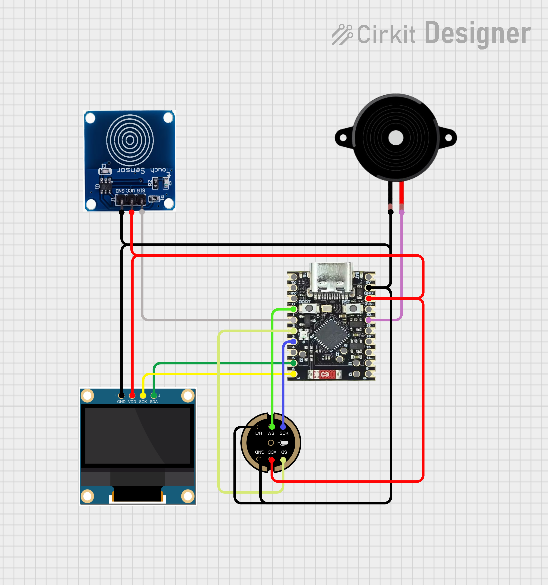
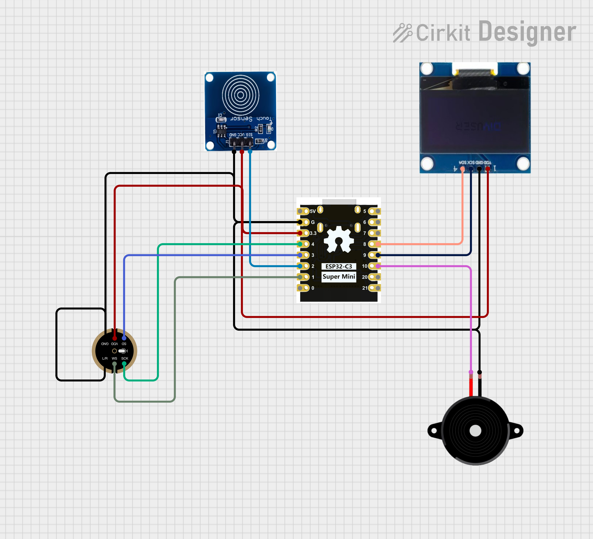

# 01 — Hardware

Aquí encontrarás todo lo que necesitas comprar y cómo conectarlo. El proyecto soporta dos variantes de microcontrolador — los componentes periféricos son los mismos, solo cambian los pines.

---

## Lista de componentes (BOM)

| Componente | Especificación | Notas |
|-----------|---------------|-------|
| **Microcontrolador** | ESP32-C6 Supermini **o** ESP32-C3 Super Mini | Elige uno; el firmware tiene versión para cada uno |
| **Pantalla** | OLED SH1106 128×64, interfaz I2C | Dirección I2C: `0x3C` |
| **Sensor táctil** | TTP223 (capacitivo) | Módulo listo para usar |
| **Micrófono** | INMP441, interfaz I2S | Detecta sonidos del ambiente |
| **Buzzer** | Pasivo (no activo) | El activo no permite reproducir melodías |
| **Cables** | Dupont hembra-hembra y hembra-macho | Para protoboard |
| **Protoboard** | 400 puntos o más | Para prototipo inicial |
| **Cable USB** | USB-C | Para programar y alimentar el ESP32 |

---

## Pinout — ESP32-C6 Supermini

### Pantalla OLED (I2C)

| Pin OLED | Pin ESP32-C6 |
|----------|-------------|
| VCC | 3.3V |
| GND | GND |
| SDA | GPIO 6 |
| SCL | GPIO 7 |

### Sensor táctil TTP223

| Pin TTP223 | Pin ESP32-C6 |
|-----------|-------------|
| VCC | 3.3V |
| GND | GND |
| OUT | GPIO 2 |

### Micrófono INMP441 (I2S)

| Pin INMP441 | Pin ESP32-C6 |
|------------|-------------|
| VDD | 3.3V |
| GND | GND |
| L/R | GND (canal izquierdo) |
| WS | GPIO 5 |
| SCK | GPIO 4 |
| SD | GPIO 3 |

### Buzzer

| Pin Buzzer | Pin ESP32-C6 |
|-----------|-------------|
| + (positivo) | GPIO 19 |
| − (negativo) | GND |

### Diagrama de conexión — ESP32-C6

---

## Pinout — ESP32-C3 Super Mini

Los pines cambian respecto al C6, especialmente SDA, SCL, Buzzer y WS del micrófono.

### Pantalla OLED (I2C)

| Pin OLED | Pin ESP32-C3 |
|----------|-------------|
| VCC | 3.3V |
| GND | GND |
| SDA | GPIO 8 |
| SCL | GPIO 9 |

### Sensor táctil TTP223

| Pin TTP223 | Pin ESP32-C3 |
|-----------|-------------|
| VCC | 3.3V |
| GND | GND |
| OUT | GPIO 2 |

### Micrófono INMP441 (I2S)

| Pin INMP441 | Pin ESP32-C3 |
|------------|-------------|
| VDD | 3.3V |
| GND | GND |
| L/R | GND (canal izquierdo) |
| WS | GPIO 1 |
| SCK | GPIO 4 |
| SD | GPIO 3 |

### Buzzer

| Pin Buzzer | Pin ESP32-C3 |
|-----------|-------------|
| + (positivo) | GPIO 10 |
| − (negativo) | GND |

### Diagrama de conexión — ESP32-C3

---

## Recomendaciones

- Usa el voltaje de **3.3V**, no 5V — ambos microcontroladores operan a 3.3V.
- Verifica que el buzzer sea **pasivo**; los buzzer activos emiten solo un tono fijo.
- Si la pantalla no aparece, verifica la dirección I2C con un sketch de scanner I2C.
- El micrófono INMP441 tiene un pin L/R: conectado a GND selecciona el canal izquierdo (necesario para que el ESP32 lea datos correctamente).

---

## Siguiente paso

Con los componentes conectados, continúa con [02_software/](../02_software/) para configurar el entorno de programación.
