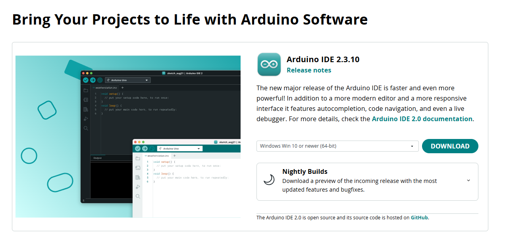
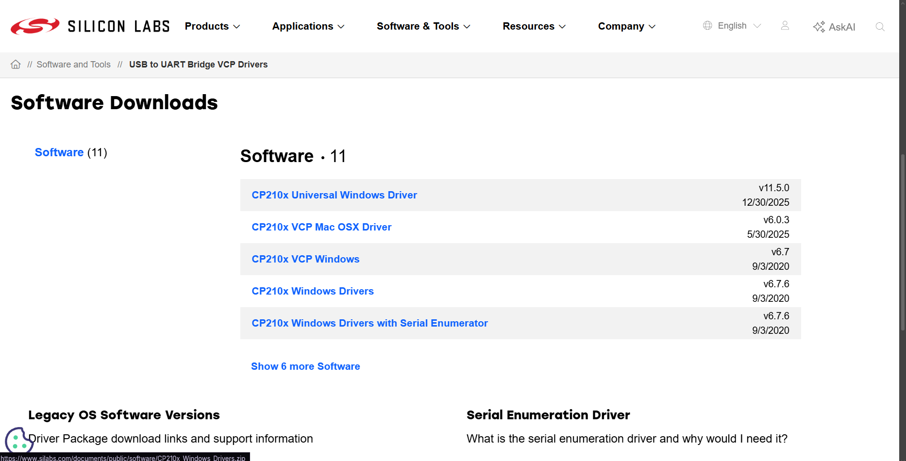
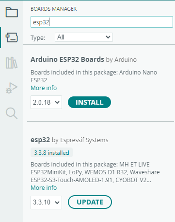
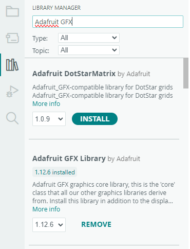
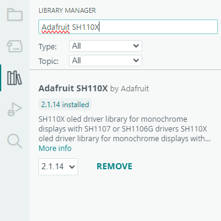
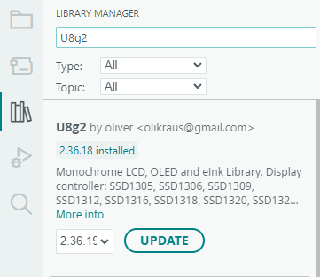
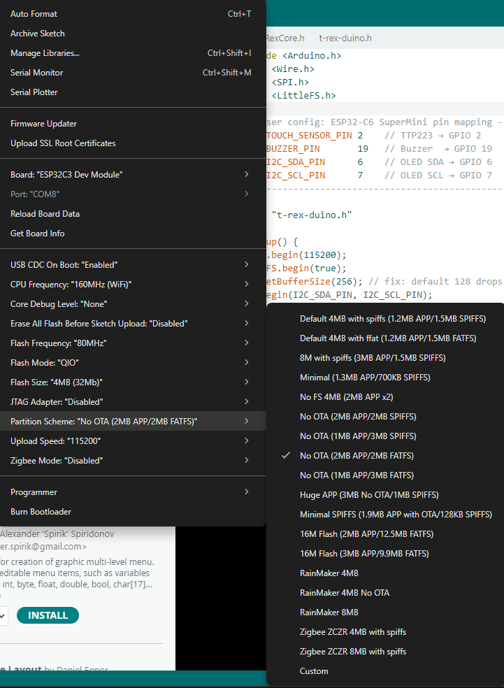

# Sección 2 — Preparación del entorno

Instala y configura Arduino IDE para poder compilar y cargar el firmware de Mochi en el ESP32.

---

## ¿Qué vas a instalar?

| Herramienta | Para qué sirve |
|-------------|----------------|
| **Arduino IDE** | Entorno de programación principal |
| **Driver CP210X** | Permite que el PC reconozca el ESP32 al conectarlo por USB |
| **Core ESP32** | Enseña a Arduino IDE a compilar para el ESP32-C3 y ESP32-C6 |
| **Adafruit GFX Library** | Motor gráfico para la pantalla OLED |
| **Adafruit SH110X** | Driver del controlador SH1106 de la pantalla |
| **U8g2** | Renderiza los GIFs animados en el Modo 1 |

---

## Paso 1 — Descargar e instalar Arduino IDE

Descarga la versión más reciente desde la página oficial:

**[https://www.arduino.cc/en/software/](https://www.arduino.cc/en/software/)**



Descarga el instalador para Windows, ejecútalo y sigue los pasos por defecto. Al terminar abre Arduino IDE para verificar que inicia correctamente.

---

## Paso 2 — Instalar el driver USB (CP210X)

El ESP32-C3 y el ESP32-C6 usan el chip CP2102 para comunicarse con la computadora por USB. Si al conectar el ESP32 no aparece ningún puerto COM, necesitas instalar este driver.

**CP210X Universal Windows Driver — Silicon Labs**



Descarga el driver, descomprímelo y ejecuta el instalador. Desconecta y vuelve a conectar el ESP32 después de instalarlo — el puerto COM debería aparecer en el Administrador de dispositivos.

---

## Paso 3 — Instalar el core de ESP32

El "core" le enseña a Arduino IDE cómo compilar y subir código a los microcontroladores ESP32.

1. Abre Arduino IDE
2. Ve a **File → Preferences** (o `Ctrl+,`)
3. En el campo **Additional boards manager URLs** pega esta URL:
   ```
   https://raw.githubusercontent.com/espressif/arduino-esp32/gh-pages/package_esp32_index.json
   ```
4. Haz clic en **OK**
5. Ve a **Tools → Board → Boards Manager**
6. Busca `esp32` e instala **esp32 by Espressif Systems**

La descarga puede tardar varios minutos — solo se hace una vez.



---

## Paso 4 — Instalar las librerías

Las librerías se instalan desde **Tools → Manage Libraries** (o `Ctrl+Shift+I`). Busca cada una por nombre e instálala.

### Adafruit GFX Library

Motor gráfico base. Busca `Adafruit GFX` e instala **Adafruit GFX Library** de Adafruit.



### Adafruit SH110X

Driver de la pantalla OLED SH1106. Busca `SH110X` e instala **Adafruit SH110X** de Adafruit.

> Al instalar SH110X, Arduino IDE puede preguntarte si deseas instalar también sus dependencias — selecciona **Install All**.



### U8g2

Renderiza los GIFs animados. Busca `U8g2` e instala **U8g2** de oliver.



---

## Paso 5 — Configurar el board

Antes de compilar o subir, selecciona el microcontrolador correcto y ajusta estos parámetros en el menú **Tools**:

### ESP32-C6 Supermini

| Parámetro | Valor |
|-----------|-------|
| **Board** | `ESP32-C6 Dev Module` |
| **USB CDC On Boot** | `Enabled` |
| **Partition Scheme** | `Huge APP (3MB No OTA / 1MB SPIFFS)` |
| **Upload Speed** | `115200` |
| **Port** | El puerto COM que aparece al conectar el ESP32 |

### ESP32-C3 Super Mini

| Parámetro | Valor |
|-----------|-------|
| **Board** | `ESP32-C3 Dev Module` |
| **USB CDC On Boot** | `Enabled` |
| **Partition Scheme** | `Huge APP (3MB No OTA / 1MB SPIFFS)` |
| **Upload Speed** | `115200` |
| **Port** | El puerto COM que aparece al conectar el ESP32 |



> **¿Por qué Partition Scheme = Huge APP?**
> El firmware completo de Mochi ocupa más espacio que la partición estándar. Sin esta configuración el IDE mostrará el error `Image length doesn't fit in partition`.

> **¿Por qué USB CDC On Boot = Enabled?**
> Activa el puerto serie nativo del ESP32 por USB. Sin esto el Monitor Serial no muestra los mensajes de depuración.

---

## Paso 6 — Instalar el plugin LittleFS

El firmware de Mochi almacena los GIFs y datos en la memoria flash del ESP32 usando LittleFS. Para subir esos archivos necesitas un plugin adicional para Arduino IDE.

Busca el plugin según la versión de tu Arduino IDE:

- **Arduino IDE 2.x** — Busca el plugin `arduino-littlefs-upload` en GitHub. El video de referencia explica la instalación:
  [Instalar LittleFS en Arduino IDE 2 — YouTube](https://www.youtube.com/watch?v=vICDKOLizrU)

Pasos resumidos:
1. Descarga el archivo `.vsix` del plugin
2. En Arduino IDE 2: **File → Preferences → Additional Plugin** o instálalo arrastrando el `.vsix`
3. Reinicia Arduino IDE
4. Verifica que aparece **Sketch → Upload LittleFS to ESP32**

---

## ✅ Checklist — Sección 2

- [ ] Arduino IDE instalado y abre correctamente
- [ ] Driver CP210X instalado (el ESP32 aparece como puerto COM al conectarlo)
- [ ] Core ESP32 instalado — en **Tools → Board** aparecen `ESP32-C6 Dev Module` y `ESP32-C3 Dev Module`
- [ ] Adafruit GFX Library instalada
- [ ] Adafruit SH110X instalada
- [ ] U8g2 instalada
- [ ] Board configurado: Partition Scheme = `Huge APP` y USB CDC On Boot = `Enabled`
- [ ] Plugin LittleFS instalado — aparece **Sketch → Upload LittleFS to ESP32**

---

**← Anterior:** [01_hardware/](../01_hardware/) — conexiones del hardware
**Siguiente →** [03_firmware/](../03_firmware/) — compilar y cargar el firmware
