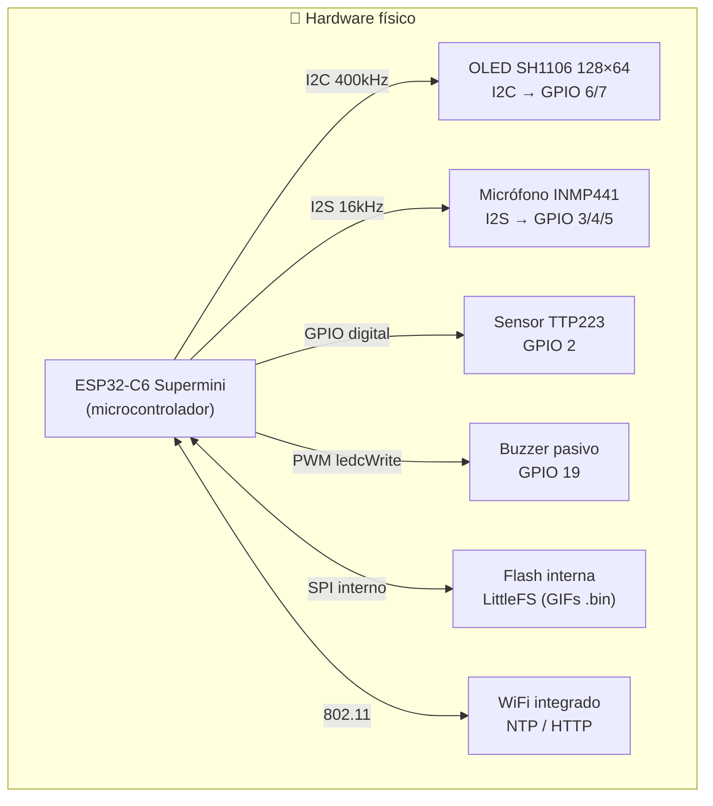
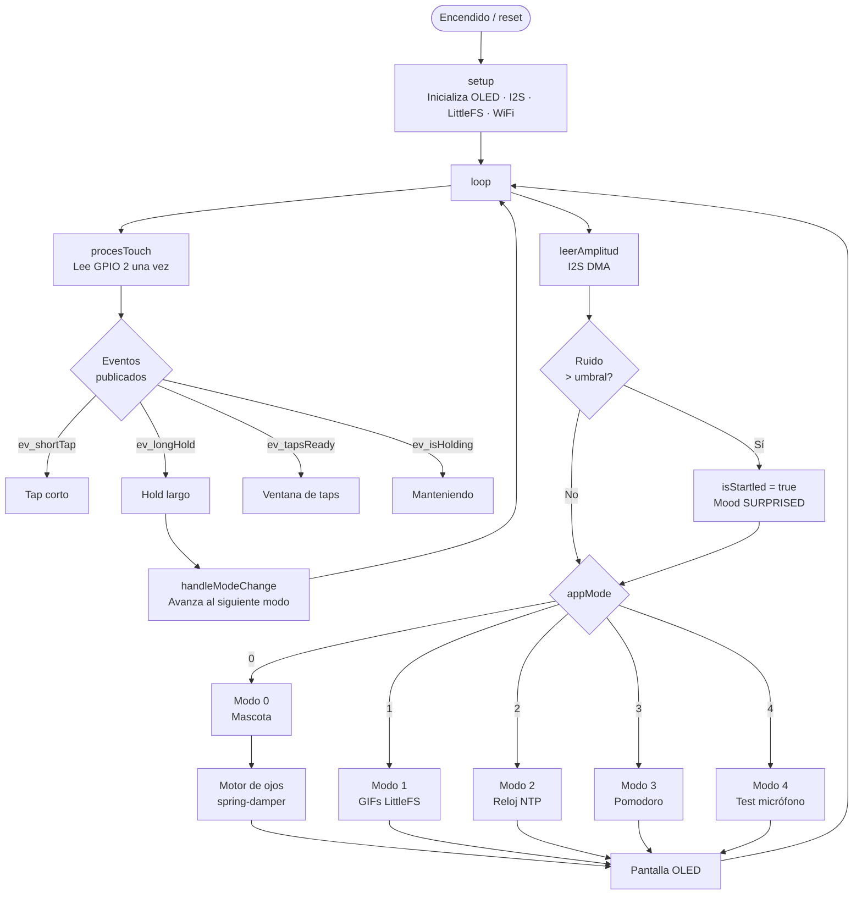
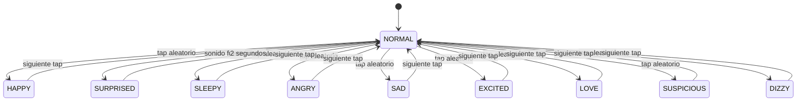
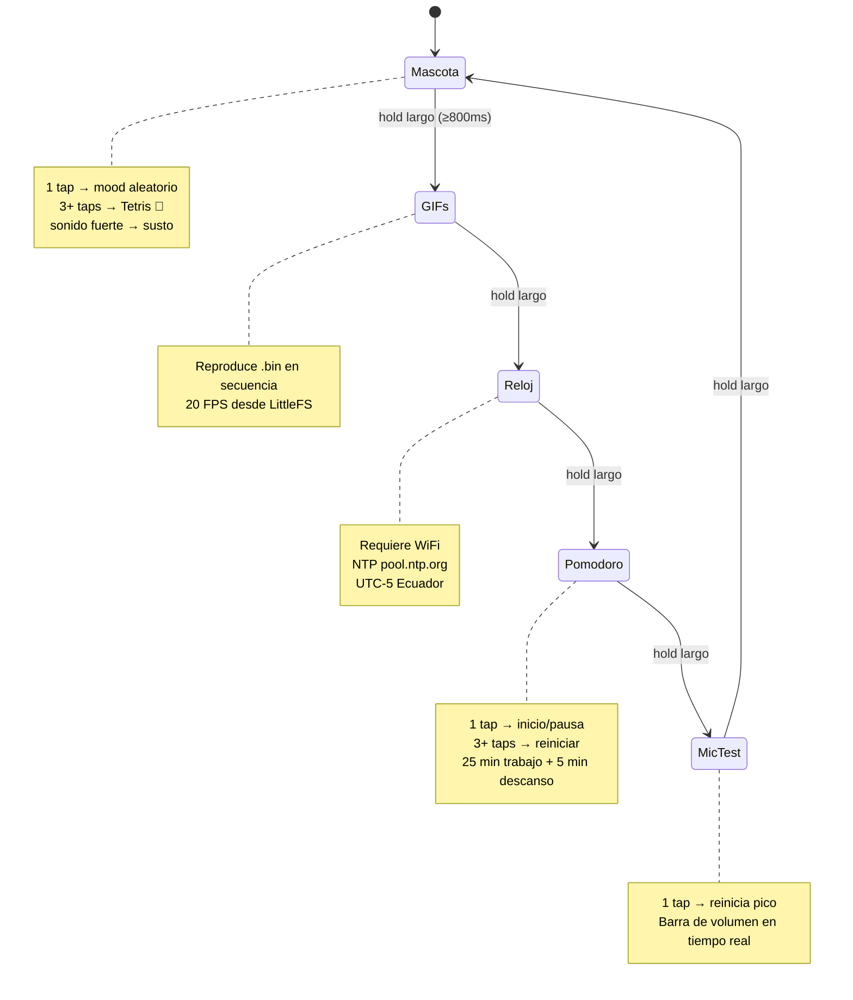
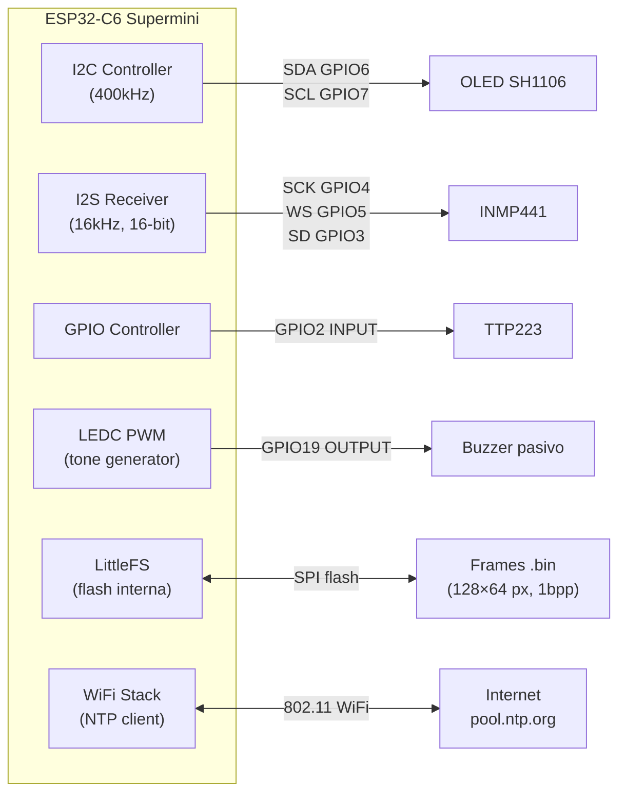
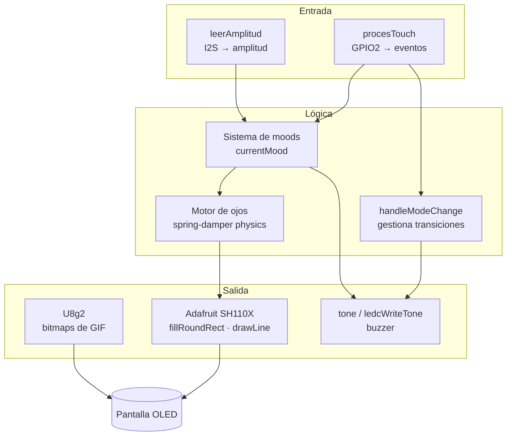

# Arquitectura del sistema — Mochi Robot

Este documento describe la arquitectura completa del robot Mochi con diagramas Mermaid.

---

## Diagrama de componentes de hardware

---

## Diagrama de software — flujo principal del firmware

---

## Diagrama de estados — sistema de moods

---

## Diagrama de estados — modos de operación

---

## Diagrama de comunicación hardware

---

## Módulos del firmware y sus responsabilidades

